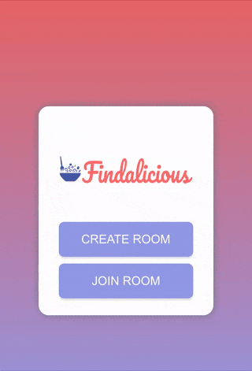
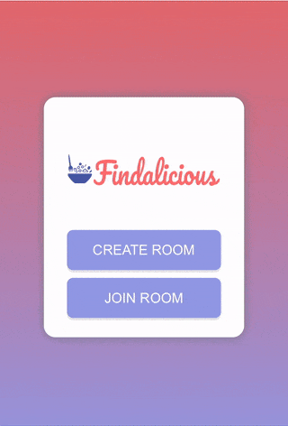

<h1 align="center">  

</h1>

## Site
[findalicious.herokuapp.com](https://findalicious.herokuapp.com)

## Description
A Tinder-style app for deciding where to eat with your friends. Quickly create a room with your friends and swipe through restaurants in your local area.

## Instructions

### Creating a Room
 1. Select `CREATE ROOM`.
 2. Allow browser to provide your location to Findalicious.
 3. Select a radius to search for restaurants.
 4. Tap on `CREATE` to create room. 
 5. Your room number should be displayed at the top.

  

### Joining a Room
 1. Tap on `JOIN ROOM` and enter room number OR
 2. Enter a URL in your browser `https://findalicious.herokuapp.com/rooms/<ROOM NUMBER>`.

  

### Swiping
 1. When all your friends are in the room and ready, tap `EVERYONE IS IN`.
 2. **Double tap** on a restaurant to scroll through photos.
 3. **Swipe** *right* to "LIKE" a restaurant or swipe *left* to dismiss a restaurant.
 4. If everyone in the room swiped *right* on ("LIKED") a restaurant, it will show up as a match!

  

### After Finding a Match
Congrats! You've found a restaurant that everyone likes.

You can tap on the restaurant photo to open it's Yelp page, or tap on the *directions icon* to open Google Maps and find directions.

If you'd like to continue swiping, tap anywhere in the background to dismiss the pop up if you are not satisfied with the match.

## License
Copyright © 2020 [Kelvin Fan](https://github.com/kelvinfan001). 
This project is [GPL-3.0](https://github.com/kelvinfan001/findalicious/blob/master/LICENSE) licensed.

### Inspiration

Shout out to my girlfriend who passive aggressively sent me [this post](https://ifunny.co/picture/okay-so-hear-me-out-an-app-right-it-s-D8bQZLQU7) after we couldn't decide on where to eat.

### Disclaimer
The author is not responsible for arguments, breakups, shouting, or otherwise emotional trauma due to the usage of this app.

> me: “Hey we finally matched on a restaurant” her: “ugh I’m not really in the mood for Chinese” me: “ THEN WHY DID YOU F\*\*KING SWIPE ON IT.” – Potential disgruntled user h<ttps://ifunny.co/picture/okay-so-hear-me-out-an-app-right-it-s-D8bQZLQU7?commentId=5e67e1cd6b014b5570533ca4>
